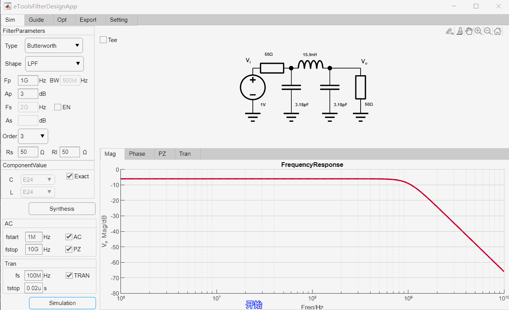
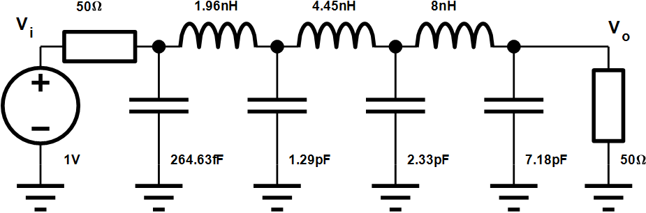
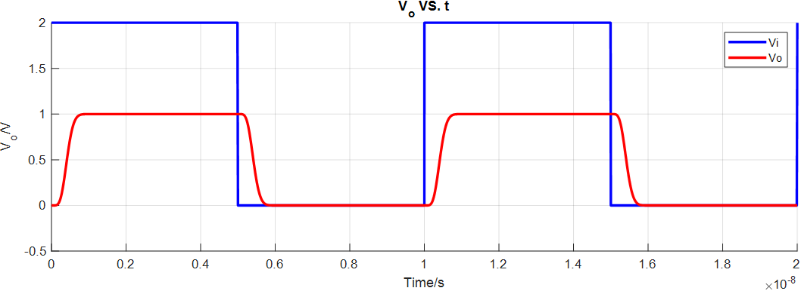
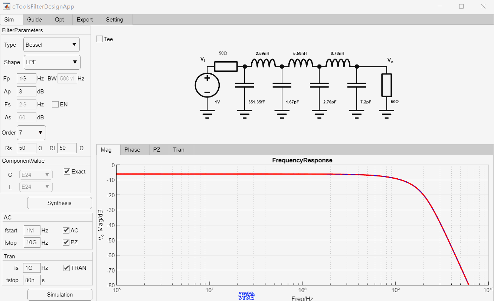
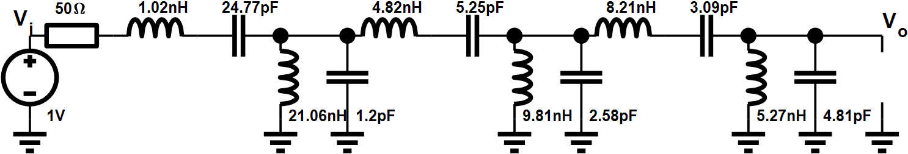
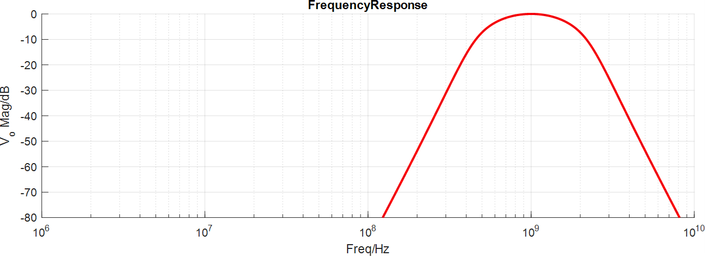
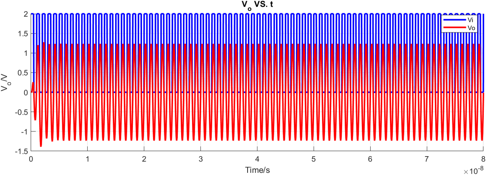
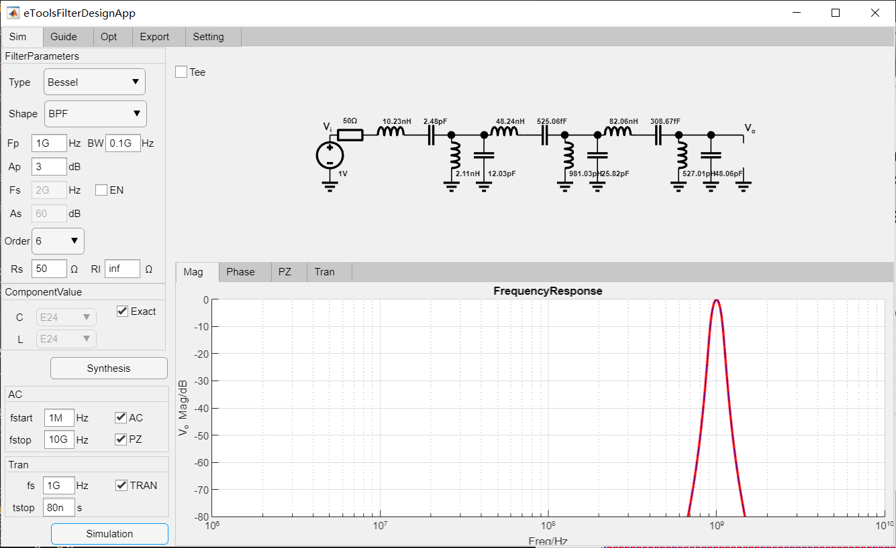
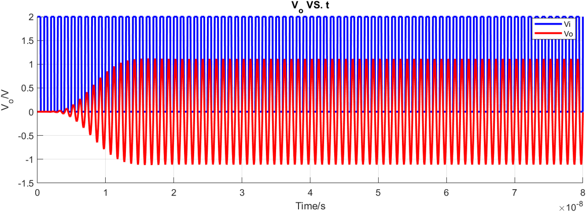
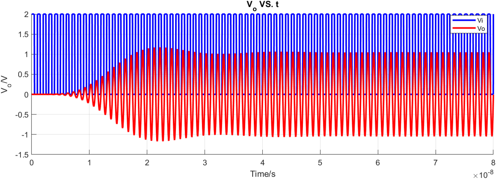

# Matlab高斯滤波器设计APP(MatlabGaussianFilterDesignApp)
> 这是一个Matlab版本滤波器设计APP，目的是为了进行无源滤波器设计，更多可以关注微信公众号"[电路设计小工具](https://mp.weixin.qq.com/s/fxfEnir-hU0YvF9_CWyI6g)".

### 如何使用(how to use)
下载整个文件包，双击eToolsFilterDesignApp.mlapp运行即可。

### 运行环境(Env)
win10, Matlab2021a

### 程序结构

更多技术细节可以参考$^{[1][2][3][4][5][6][7][8][9]}$

### 特性
基于Matlab的appdesign工具开发了一套滤波器设计软件, 主要特点是：
- 支持高斯滤波器(Gaussian Filter)、贝塞尔滤波器(Bessel Filter)、椭圆函数滤波器(Elliptic/Cauer Filter)、切比雪夫滤波器(Chebyshev I)、逆切比雪夫滤波器(Chebyshev II, Inverse Chebyshev)、巴特沃斯滤波器(Butterworth)设计
- 支持4种不同滤波器通带类型(LPF,HPF,BPF,BRF)设计
- T型和PI型结构滤波器随意切换
- 可以设置阻带衰减决定滤波器阶数
- 可以设置通带衰减来综合滤波器
- 可以随意配置负载和终端阻抗, 并支持一端接载(源端电阻短路, 源端电流源, 终端开路, 终端短路)设计
- 可以幅频响应分析、零极点分析、瞬态分析
- 可以显示理想频率响应、零极点和实际仿真的的频率响应、零极点
- 可以支持实际标准器件逼近设计

### 运行效果(demo)

#### Gaussian LPF设计举例
设计一款-3dB截止频率为1GHz, 7阶低通Gaussian滤波器，输入输出阻抗为50欧姆，设计过程如下：

最终设计参数如下：

高斯滤波器瞬态仿真结果：

#### Gaussian BPF设计举例
设计6阶带通Gaussian滤波器, 中心频率为1GHz，带宽为1GHz，50欧姆输入，输出阻抗为高阻，最后进行瞬态仿真，设计过程如下：

最终设计参数如下：

AC仿真结果：

瞬态仿真结果：

如果将滤波器带宽继续变窄为100MHz：

高斯滤波器的瞬态特性：

同样参数对比贝塞尔滤波器的瞬态特性：

同样参数对比巴特沃斯瞬态特性:

可以看到同样滤波器设置参数下，高斯滤波器具有最小延迟和最小过冲。

程序的Matalb源码已经上传GitHub中$^{[11]}$(https://github.com/etools361/MatlabGaussianFilterDesignApp)，有兴趣的同学可以下载试用体验，当然也欢迎技术交流。

### 参考(ref)
[1] : [模拟无源滤波器设计（一）-滤波器历史](https://mp.weixin.qq.com/s/wNRHyBHpimjU90bymHp7JA) \
[2] : [模拟无源滤波器设计（二）-梯形网络综合](https://mp.weixin.qq.com/s/3GMQs4WDm683tdAXqyoOgQ) \
[3] : [模拟无源滤波器设计（三）-梯形网络仿真](https://mp.weixin.qq.com/s/nZFx7weLcO-WRKLbP0T4jQ) \
[4] : [模拟无源滤波器设计（四）-通用无源网络仿真](https://mp.weixin.qq.com/s/mllwGShvbh3TWdFRbp9LhQ) \
[5] : [模拟无源滤波器设计（五）-Butterworth滤波器设计详解](https://mp.weixin.qq.com/s/pIMPIh8ize49mxXG4SHT_w) \
[6] : [模拟无源滤波器设计（六）-Chebyshev滤波器设计详解](https://mp.weixin.qq.com/s/6b1HF81X93M9D4yfIAFROw) \
[7] : [模拟无源滤波器设计（七）-Elliptic滤波器设计详解](https://mp.weixin.qq.com/s/6b1HF81X93M9D4yfIAFROw) \
[8] : [模拟无源滤波器设计（八）-Bessel滤波器设计详解](https://mp.weixin.qq.com/s/PE0A3CqseqTcnJ01mNUlhw) \
[9] : [模拟无源滤波器设计（九）-Gaussian滤波器设计详解](https://mp.weixin.qq.com/s/7Ecx-IgPPrAIe0tRWhgxnw) \
[10] : [欢迎关注电路设计小工具公众号](https://mp.weixin.qq.com/s/fxfEnir-hU0YvF9_CWyI6g) \
[11] : [Matlab源码地址](https://github.com/etools361/MatlabGaussianFilterDesignApp)
